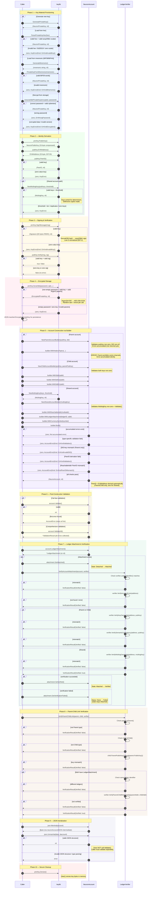
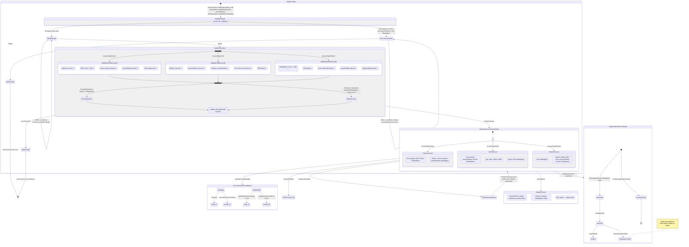
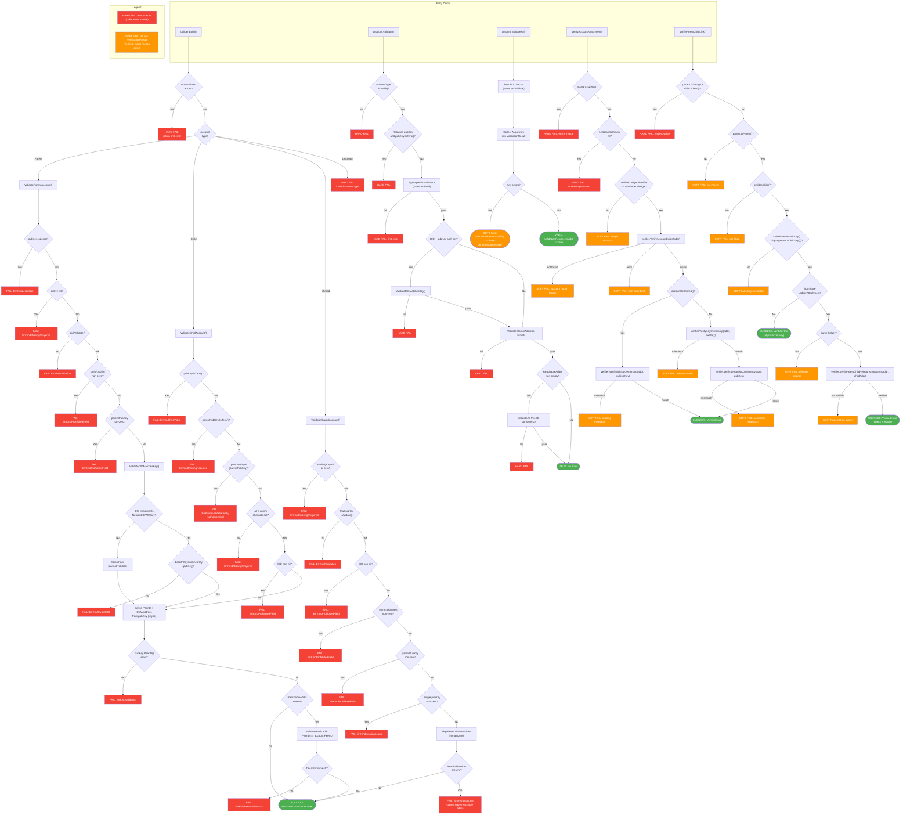

# System Lifecycle Diagrams

---

## Diagram 1: High-Level Interaction Flow

```mermaid
sequenceDiagram
    autonumber
    participant Caller
    participant keylib
    participant Account as NeuronAccount
    participant Ledger as LedgerVerifier

    %% =========================================
    %% Phase 1: Key Creation / Loading
    %% =========================================
    rect rgb(235, 245, 255)
        Note over Caller,keylib: Phase 1 — Key Material Provisioning

        alt Generate new key
            Caller->>keylib: GeneratePrivateKey()
            keylib-->>Caller: (NeuronPrivateKey, nil)
        else Load from hex
            Caller->>keylib: ParsePrivateKeyHex(hex)
            alt valid hex + valid secp256k1 scalar
                keylib-->>Caller: (NeuronPrivateKey, nil)
            else invalid hex / Ed25519 / zero scalar
                keylib-->>Caller: (zero, KeyError{Kind: ErrKindInvalidKey})
            end
        else Load from mnemonic (BIP39/BIP44)
            Caller->>keylib: GenerateMnemonic()
            keylib-->>Caller: (mnemonic string, nil)
            Caller->>keylib: PrivateKeyFromMnemonic(mnemonic)
            alt valid BIP39 words
                keylib-->>Caller: (NeuronPrivateKey, nil)
            else invalid mnemonic
                keylib-->>Caller: (zero, KeyError{Kind: ErrKindMnemonic})
            end
        else Decrypt from storage
            Caller->>keylib: UnscramblePrivateKey(encrypted, password)
            alt correct password + valid ciphertext
                keylib-->>Caller: (NeuronPrivateKey, nil)
            else wrong password
                keylib-->>Caller: (zero, ErrWrongPassword)
            else corrupted data / invalid version
                keylib-->>Caller: (zero, KeyError{Kind: ErrKindEncryption})
            end
        end
    end

    %% =========================================
    %% Phase 2: Key Derivation Chain
    %% =========================================
    rect rgb(240, 255, 240)
        Note over Caller,keylib: Phase 2 — Identity Derivation

        Caller->>keylib: privKey.PublicKey()
        keylib-->>Caller: NeuronPublicKey (33-byte compressed)

        Caller->>keylib: pubKey.EVMAddress()
        keylib-->>Caller: EVMAddress (20-byte, EIP-55)

        Caller->>keylib: pubKey.PeerID()
        alt valid key
            keylib-->>Caller: (PeerID, nil)
        else zero-value key
            keylib-->>Caller: (zero, KeyError)
        end

        opt Shared account path
            Caller->>keylib: NewMultisigKey(pubKeys, threshold)
            alt valid keys + threshold
                keylib-->>Caller: (MultisigKey, nil)
                Note right of keylib: Keys sorted for determinism.<br/>Defensive copies made.
            else threshold > len / duplicates / zero keys
                keylib-->>Caller: (zero, KeyError)
            end
        end
    end

    %% =========================================
    %% Phase 3: Signing & Verification
    %% =========================================
    rect rgb(255, 250, 235)
        Note over Caller,keylib: Phase 3 — Signing & Verification

        Caller->>keylib: privKey.SignMessage(msg)
        alt valid key
            keylib-->>Caller: (Signature [65 bytes R‖S‖V], nil)
            Note right of keylib: Keccak256 hash → secp256k1 sign.<br/>Low-S normalized (EIP-2).
        else zero-value key
            keylib-->>Caller: (zero, KeyError{Kind: ErrKindInvalidKey})
        end

        Caller->>keylib: pubKey.Verify(msg, sig)
        alt valid key + valid sig
            keylib-->>Caller: true / false
        else zero key or zero sig
            keylib-->>Caller: false (no error)
        end
    end

    %% =========================================
    %% Phase 4: Key Encryption for Storage
    %% =========================================
    rect rgb(255, 240, 245)
        Note over Caller,keylib: Phase 4 — Encrypted Storage

        Caller->>keylib: privKey.Scramble(password, opts...)
        alt non-empty password + valid key + valid Argon2 params
            keylib-->>Caller: (EncryptedPrivateKey, nil)
            Note right of keylib: Argon2id KDF → AES-256-GCM.<br/>Random salt + nonce per call.
        else empty password / zero key / invalid params
            keylib-->>Caller: (zero, KeyError)
        end
        Caller->>Caller: JSON marshal EncryptedPrivateKey for persistence
    end

    %% =========================================
    %% Phase 5: Account Construction
    %% =========================================
    rect rgb(245, 240, 255)
        Note over Caller,Account: Phase 5 — Account Construction via Builder

        alt Parent account
            Caller->>Account: NewParentAccountBuilder(pubKey, did)
            Note right of Account: Validates pubKey non-zero, DID non-nil.<br/>Errors accumulated (not returned yet).
            Caller->>Account: builder.WithHederaTopics(...)
            Note right of Account: ERROR: Parent prohibits comm channels.<br/>Error accumulated silently.
        else Child account
            Caller->>Account: NewChildAccountBuilder(pubKey, parentPubKey)
            Note right of Account: Validates both keys non-zero.
            Caller->>Account: builder.WithStdIn(addr)
            Caller->>Account: builder.WithStdOut(addr)
            Caller->>Account: builder.WithStdErr(addr)
        else Shared account
            Caller->>keylib: NewMultisigKey(keys, threshold)
            keylib-->>Caller: (MultisigKey, nil)
            Caller->>Account: NewSharedAccountBuilder(multisigKey)
            Note right of Account: Validates MultisigKey non-zero + Validate().
        end

        Caller->>Account: builder.WithReachableAddr(multiaddr)
        Caller->>Account: builder.WithLedgerAttachment(ledgerID, addr)
        Caller->>Account: builder.WithCurrencySymbol(symbol)

        Caller->>Account: builder.Build()
        alt accumulated errors exist
            Account-->>Caller: (zero, first accumulated error)
        else type-specific validation fails
            Account-->>Caller: (zero, AccountError{Kind: ErrKindValidation})
        else DID-key mismatch (Parent only)
            Account-->>Caller: (zero, AccountError{Kind: ErrKindInvalidDID})
        else PeerID derivation fails
            Account-->>Caller: (zero, AccountError{Kind: ErrKindValidation})
        else ReachableAddr PeerID mismatch
            Account-->>Caller: (zero, AccountError{Kind: ErrKindPeerIDMismatch})
        else all checks pass
            Account-->>Caller: (NeuronAccount, nil)
            Note right of Account: PeerID + EVMAddress derived automatically<br/>(Parent/Child only, zero for Shared).
        end
    end

    %% =========================================
    %% Phase 6: Post-Construction Validation
    %% =========================================
    rect rgb(255, 255, 235)
        Note over Caller,Account: Phase 6 — Post-Construction Validation

        alt Fail-fast validation
            Caller->>Account: account.Validate()
            alt valid
                Account-->>Caller: nil
            else first error found
                Account-->>Caller: AccountError (stops at first)
            end
        else Comprehensive validation
            Caller->>Account: account.ValidateAll()
            Account-->>Caller: *ValidationResult (all errors collected)
        end
    end

    %% =========================================
    %% Phase 7: Ledger Attachment & Verification
    %% =========================================
    rect rgb(240, 250, 245)
        Note over Caller,Ledger: Phase 7 — Ledger Attachment & Verification

        Caller->>Account: account.LedgerAttachment()
        Account-->>Caller: *LedgerAttachment (or nil)

        opt Attachment exists
            Caller->>Account: attachment.SetAttached()
            Note right of Account: State: Detached → Attached

            Caller->>Ledger: VerifyAccountAttachment(account, verifier)

            Ledger->>Ledger: Check verifier.LedgerIdentifier() matches
            alt mismatch
                Ledger-->>Caller: VerificationResult{Verified: false}
            end

            Ledger->>Ledger: verifier.VerifyAccountExists(address)
            alt not found / error
                Ledger-->>Caller: VerificationResult{Verified: false}
            end

            alt Parent or Child
                Ledger->>Ledger: verifier.VerifyKeyOwnership(address, pubKey)
                alt mismatch
                    Ledger-->>Caller: VerificationResult{Verified: false}
                end
                Ledger->>Ledger: verifier.VerifySemanticConsistency(address, pubKey)
                alt mismatch
                    Ledger-->>Caller: VerificationResult{Verified: false}
                end
            else Shared
                Ledger->>Ledger: verifier.VerifyMultisigOwnership(address, multisigKey)
                alt mismatch
                    Ledger-->>Caller: VerificationResult{Verified: false}
                end
            end

            Ledger-->>Caller: VerificationResult{Verified: true}

            alt verification succeeded
                Caller->>Account: attachment.SetVerified()
                Note right of Account: State: Attached → Verified
            else verification failed
                Caller->>Account: attachment.SetVerificationFailed()
                Note right of Account: Status: None → Failed<br/>(state stays Attached)
            end
        end
    end

    %% =========================================
    %% Phase 8: Parent-Child Link Verification
    %% =========================================
    rect rgb(250, 245, 240)
        Note over Caller,Ledger: Phase 8 — Parent-Child Link Verification

        Caller->>Ledger: VerifyParentChildLink(parent, child, verifier)

        Ledger->>Ledger: Check parent.IsParent()
        alt not Parent type
            Ledger-->>Caller: VerificationResult{Verified: false}
        end

        Ledger->>Ledger: Check child.IsChild()
        alt not Child type
            Ledger-->>Caller: VerificationResult{Verified: false}
        end

        Ledger->>Ledger: child.ParentPublicKey().Equal(parent.PublicKey())
        alt key mismatch
            Ledger-->>Caller: VerificationResult{Verified: false}
        end

        opt Both have LedgerAttachment
            Ledger->>Ledger: Check same ledger identifier
            alt different ledgers
                Ledger-->>Caller: VerificationResult{Verified: false}
            end
            Ledger->>Ledger: verifier.VerifyParentChildRelationship(parentAddr, childAddr)
            alt not verified
                Ledger-->>Caller: VerificationResult{Verified: false}
            end
        end

        Ledger-->>Caller: VerificationResult{Verified: true}
    end

    %% =========================================
    %% Phase 9: Serialization
    %% =========================================
    rect rgb(245, 245, 250)
        Note over Caller,Account: Phase 9 — JSON Serialization

        Caller->>Account: json.Marshal(account)
        Account-->>Caller: []byte (via neuronAccountJSON intermediate)

        Caller->>Account: json.Unmarshal(data, &account)
        alt valid JSON structure
            Account-->>Caller: nil
            Note right of Account: Does NOT call Validate().<br/>Caller must validate separately.
        else invalid JSON structure / type parsing
            Account-->>Caller: error
        end
    end

    %% =========================================
    %% Phase 10: Cleanup
    %% =========================================
    rect rgb(255, 240, 240)
        Note over Caller,keylib: Phase 10 — Secure Cleanup

        Caller->>keylib: privKey.Zeroize()
        Note right of keylib: clear() zeroes key bytes in memory
    end
```

---

## Diagram 2: NeuronAccount Lifecycle

```mermaid
stateDiagram-v2
    direction TB

    %% =========================================
    %% Builder Phase
    %% =========================================
    state "Builder Phase" as BuilderPhase {
        [*] --> BuilderCreated: NewParentAccountBuilder(pubKey, did)<br/>NewChildAccountBuilder(pubKey, parentPubKey)<br/>NewSharedAccountBuilder(multisigKey)

        state BuilderCreated {
            state "Constructor Validation" as CtorValidation
            CtorValidation --> ErrorsAccumulated: zero pubKey / nil DID /<br/>zero parentPubKey / zero MultisigKey
            CtorValidation --> BuilderReady: all required args valid
        }

        BuilderReady --> BuilderReady: With*(...)  methods<br/>Errors accumulated silently

        state "Error Accumulation" as ErrorsAccumulated
        ErrorsAccumulated --> ErrorsAccumulated: With*(...) methods continue<br/>accumulating more errors

        BuilderReady --> BuildAttempt: Build()
        ErrorsAccumulated --> BuildFailed_Accumulated: Build()

        state "Build() Execution" as BuildAttempt {
            state build_fork <<fork>>
            state build_join <<join>>

            build_fork --> ParentValidation: AccountTypeParent
            build_fork --> ChildValidation: AccountTypeChild
            build_fork --> SharedValidation: AccountTypeShared

            state "ValidateParentAccount()" as ParentValidation {
                state "pubKey non-zero ✓" as pp1
                state "DID non-nil + valid ✓" as pp2
                state "comm channels absent ✓" as pp3
                state "parentPubKey absent ✓" as pp4
                state "DID matches key ✓" as pp5
            }

            state "ValidateChildAccount()" as ChildValidation {
                state "pubKey non-zero ✓" as cp1
                state "parentPubKey non-zero ✓" as cp2
                state "pubKey ≠ parentPubKey ✓" as cp3
                state "all 3 comm channels set ✓" as cp4
                state "DID absent ✓" as cp5
            }

            state "ValidateSharedAccount()" as SharedValidation {
                state "MultisigKey non-nil + valid ✓" as sp1
                state "DID absent ✓" as sp2
                state "comm channels absent ✓" as sp3
                state "parentPubKey absent ✓" as sp4
                state "single pubKey absent ✓" as sp5
            }

            ParentValidation --> build_join
            ChildValidation --> build_join
            SharedValidation --> build_join

            build_join --> DeriveIdentifiers: Parent/Child derive<br/>PeerID + EVMAddress
            build_join --> SkipDerivation: Shared: no derivation<br/>(PeerID/EVMAddress remain zero)

            DeriveIdentifiers --> ReachableAddrCheck
            SkipDerivation --> ReachableAddrCheck

            state "Validate ReachableAddr PeerIDs" as ReachableAddrCheck
        }

        BuildAttempt --> AccountConstructed: all checks pass
        BuildAttempt --> BuildFailed_Validation: any check fails
    }

    state "Build Failed" as BuildFailed_Accumulated
    state "Build Failed" as BuildFailed_Validation
    BuildFailed_Accumulated --> [*]: returns (zero, first error)
    BuildFailed_Validation --> [*]: returns (zero, AccountError)

    %% =========================================
    %% Constructed Account Phase
    %% =========================================
    state "NeuronAccount (Constructed)" as AccountConstructed {
        state account_type <<choice>>

        [*] --> account_type

        account_type --> ParentAccount: AccountTypeParent
        account_type --> ChildAccount: AccountTypeChild
        account_type --> SharedAccount: AccountTypeShared

        state "Parent Account" as ParentAccount {
            state "Has: pubKey, DID, PeerID, EVMAddress" as pa_has
            state "Absent: comm channels, parentPubKey, MultisigKey" as pa_absent
        }

        state "Child Account" as ChildAccount {
            state "Has: pubKey, parentPubKey, PeerID, EVMAddress" as ca_has
            state "Has: stdIn, stdOut, stdErr" as ca_comm
            state "Absent: DID, MultisigKey" as ca_absent
        }

        state "Shared Account" as SharedAccount {
            state "Has: MultisigKey" as sa_has
            state "Absent: pubKey, DID, comm, parentPubKey, PeerID, EVMAddress" as sa_absent
        }
    }

    %% =========================================
    %% Operational Phase
    %% =========================================
    AccountConstructed --> PostValidation: Validate() / ValidateAll()
    AccountConstructed --> Serialization: MarshalJSON()
    AccountConstructed --> Deserialization: UnmarshalJSON()
    AccountConstructed --> EqualityCheck: Equal(other)
    AccountConstructed --> LedgerFlow: LedgerAttachment operations

    state "Post-Construction Validation" as PostValidation {
        state "Validate()" as ValidateFast
        state "ValidateAll()" as ValidateAll

        ValidateFast --> Valid_FF: nil (pass)
        ValidateFast --> Invalid_FF: AccountError (first failure)

        ValidateAll --> Valid_All: ValidationResult.IsValid() == true
        ValidateAll --> Invalid_All: ValidationResult with all errors
    }

    state "JSON Round-Trip" as Serialization
    state "JSON Deserialization" as Deserialization

    Deserialization --> AccountConstructed: returns NeuronAccount<br/>(caller must validate separately)

    state "Equality Check" as EqualityCheck {
        state "Parent/Child: compare PublicKey (constant-time)" as eq_pk
        state "Shared: compare MultisigKey config" as eq_mk
        state "Zero values → always false" as eq_zero
    }

    %% =========================================
    %% Ledger Attachment Lifecycle
    %% =========================================
    state "Ledger Attachment Lifecycle" as LedgerFlow {
        state "No Attachment" as NoAttach
        state "Detached" as Detached
        state "Attached" as Attached
        state "Verified" as Verified
        state "Verification Failed" as VFailed

        [*] --> NoAttach: no WithLedgerAttachment()
        [*] --> Detached: NewLedgerAttachment(ledgerID, addr)

        NoAttach --> [*]

        Detached --> Attached: SetAttached()
        Attached --> Verified: SetVerified()
        Attached --> VFailed: SetVerificationFailed()
        Note left of VFailed: State stays Attached.<br/>Only status changes to Failed.
    }
```

---

## Diagram 3: Validation & Verification Flow

```mermaid
flowchart TB
    subgraph entry ["Entry Points"]
        B["builder.Build()"]
        V["account.Validate()"]
        VA["account.ValidateAll()"]
        VAA["VerifyAccountAttachment()"]
        VPC["VerifyParentChildLink()"]
    end

    %% =========================================
    %% Build() Validation Flow
    %% =========================================
    B --> B1{"Accumulated<br/>errors?"}
    B1 -->|Yes| B1F["HARD FAIL:<br/>return first error"]
    B1 -->|No| B2{"Account<br/>type?"}

    B2 -->|Parent| PV["ValidateParentAccount()"]
    B2 -->|Child| CV["ValidateChildAccount()"]
    B2 -->|Shared| SV["ValidateSharedAccount()"]
    B2 -->|Unknown| B2F["HARD FAIL:<br/>invalid account type"]

    %% Parent Validation Chain
    PV --> PV1{"pubKey.IsZero()?"}
    PV1 -->|Yes| PVF1["FAIL: ErrKindZeroValue"]
    PV1 -->|No| PV2{"did == nil?"}
    PV2 -->|Yes| PVF2["FAIL: ErrKindMissingRequired"]
    PV2 -->|No| PV3{"did.Validate()"}
    PV3 -->|err| PVF3["FAIL: ErrKindValidation"]
    PV3 -->|ok| PV4{"stdIn/Out/Err<br/>non-zero?"}
    PV4 -->|Yes| PVF4["FAIL: ErrKindProhibitedField"]
    PV4 -->|No| PV5{"parentPubKey<br/>non-zero?"}
    PV5 -->|Yes| PVF5["FAIL: ErrKindProhibitedField"]
    PV5 -->|No| DID_CHECK

    %% DID-Key Match (Parent only)
    DID_CHECK["ValidateDIDMatchesKey()"]
    DID_CHECK --> DK1{"DID implements<br/>NeuronDIDWithKey?"}
    DK1 -->|No| DK_SKIP["Skip check<br/>(cannot validate)"]
    DK1 -->|Yes| DK2{"didWithKey.MatchesKey<br/>(pubKey)?"}
    DK2 -->|No| DKF["FAIL: ErrKindInvalidDID"]
    DK2 -->|Yes| DERIVE
    DK_SKIP --> DERIVE

    %% Child Validation Chain
    CV --> CV1{"pubKey.IsZero()?"}
    CV1 -->|Yes| CVF1["FAIL: ErrKindZeroValue"]
    CV1 -->|No| CV2{"parentPubKey.IsZero()?"}
    CV2 -->|Yes| CVF2["FAIL: ErrKindMissingRequired"]
    CV2 -->|No| CV3{"pubKey.Equal<br/>(parentPubKey)?"}
    CV3 -->|Yes| CVF3["FAIL: ErrKindInvalidHierarchy<br/>(self-parenting)"]
    CV3 -->|No| CV4{"all 3 comm<br/>channels set?"}
    CV4 -->|No| CVF4["FAIL: ErrKindMissingRequired"]
    CV4 -->|Yes| CV5{"DID non-nil?"}
    CV5 -->|Yes| CVF5["FAIL: ErrKindProhibitedField"]
    CV5 -->|No| DERIVE

    %% Shared Validation Chain
    SV --> SV1{"MultisigKey nil<br/>or zero?"}
    SV1 -->|Yes| SVF1["FAIL: ErrKindMissingRequired"]
    SV1 -->|No| SV2{"MultisigKey<br/>.Validate()"}
    SV2 -->|err| SVF2["FAIL: ErrKindValidation"]
    SV2 -->|ok| SV3{"DID non-nil?"}
    SV3 -->|Yes| SVF3["FAIL: ErrKindProhibitedField"]
    SV3 -->|No| SV4{"comm channels<br/>non-zero?"}
    SV4 -->|Yes| SVF4["FAIL: ErrKindProhibitedField"]
    SV4 -->|No| SV5{"parentPubKey<br/>non-zero?"}
    SV5 -->|Yes| SVF5["FAIL: ErrKindProhibitedField"]
    SV5 -->|No| SV6{"single pubKey<br/>non-zero?"}
    SV6 -->|Yes| SVF6["FAIL: ErrKindInvalidAccount"]
    SV6 -->|No| SKIP_DERIVE

    %% Derivation
    DERIVE["Derive PeerID + EVMAddress<br/>from pubKey (keylib)"]
    DERIVE --> D1{"pubKey.PeerID()<br/>error?"}
    D1 -->|err| DF1["FAIL: ErrKindValidation"]
    D1 -->|ok| RA_CHECK

    SKIP_DERIVE["Skip PeerID/EVMAddress<br/>(remain zero)"]
    SKIP_DERIVE --> RA_CHECK_SHARED

    %% ReachableAddr check
    RA_CHECK{"ReachableAddrs<br/>present?"}
    RA_CHECK -->|No| BUILD_OK
    RA_CHECK -->|Yes| RA1["Validate each addr<br/>PeerID == account PeerID"]
    RA1 --> RA2{"PeerID mismatch?"}
    RA2 -->|Yes| RAF["FAIL: ErrKindPeerIDMismatch"]
    RA2 -->|No| BUILD_OK

    RA_CHECK_SHARED{"ReachableAddrs<br/>present?"}
    RA_CHECK_SHARED -->|No| BUILD_OK
    RA_CHECK_SHARED -->|Yes| RASF["FAIL: Shared accounts<br/>cannot have reachable addrs"]

    BUILD_OK(["SUCCESS:<br/>NeuronAccount constructed"])

    %% =========================================
    %% Validate() Flow (Post-Construction)
    %% =========================================
    V --> V1{"accountType<br/>.IsValid()?"}
    V1 -->|No| VF0["HARD FAIL"]
    V1 -->|Yes| V2{"Requires pubKey<br/>and pubKey.IsZero()?"}
    V2 -->|Yes| VF1["HARD FAIL"]
    V2 -->|No| V3["Type-specific validation<br/>(same as Build)"]
    V3 -->|fail| VF2["HARD FAIL: first error"]
    V3 -->|pass| V4{"DID + pubKey both set?"}
    V4 -->|Yes| V5["ValidateDIDMatchesKey()"]
    V5 -->|fail| VF3["HARD FAIL"]
    V5 -->|pass| V6
    V4 -->|No| V6
    V6["Validate CommAddress formats"]
    V6 -->|fail| VF4["HARD FAIL"]
    V6 -->|pass| V7{"ReachableAddrs<br/>non-empty?"}
    V7 -->|Yes| V8["ValidateAll PeerID consistency"]
    V8 -->|fail| VF5["HARD FAIL"]
    V8 -->|pass| V9(["VALID: return nil"])
    V7 -->|No| V9

    %% =========================================
    %% ValidateAll() Flow
    %% =========================================
    VA --> VA1["Run ALL checks<br/>(same as Validate)"]
    VA1 --> VA2["Collect ALL errors<br/>into ValidationResult"]
    VA2 --> VA3{"Any errors?"}
    VA3 -->|Yes| VA4(["SOFT FAIL:<br/>ValidationResult.IsValid() == false<br/>All errors accessible"])
    VA3 -->|No| VA5(["VALID:<br/>ValidationResult.IsValid() == true"])

    %% =========================================
    %% VerifyAccountAttachment Flow
    %% =========================================
    VAA --> VAA1{"account.IsZero()?"}
    VAA1 -->|Yes| VAAF0["HARD FAIL: errZeroValue"]
    VAA1 -->|No| VAA2{"LedgerAttachment<br/>nil?"}
    VAA2 -->|Yes| VAAF1["HARD FAIL: errMissingRequired"]
    VAA2 -->|No| VAA3{"verifier.LedgerIdentifier<br/>== attachment ledger?"}
    VAA3 -->|No| VAAF2["SOFT FAIL: ledger mismatch"]
    VAA3 -->|Yes| VAA4["verifier.VerifyAccountExists(addr)"]
    VAA4 -->|not found| VAAF3["SOFT FAIL: account not on ledger"]
    VAA4 -->|error| VAAF3E["SOFT FAIL: with Error field"]
    VAA4 -->|exists| VAA5{"account.IsShared()?"}

    VAA5 -->|Yes| VAA6["verifier.VerifyMultisigOwnership(addr, multisigKey)"]
    VAA6 -->|mismatch| VAAF4["SOFT FAIL: multisig mismatch"]
    VAA6 -->|match| VAAS(["SUCCESS: Verified=true"])

    VAA5 -->|No| VAA7["verifier.VerifyKeyOwnership(addr, pubKey)"]
    VAA7 -->|mismatch| VAAF5["SOFT FAIL: key mismatch"]
    VAA7 -->|match| VAA8["verifier.VerifySemanticConsistency(addr, pubKey)"]
    VAA8 -->|mismatch| VAAF6["SOFT FAIL: semantics mismatch"]
    VAA8 -->|match| VAAS

    %% =========================================
    %% VerifyParentChildLink Flow
    %% =========================================
    VPC --> VPC1{"parent.IsZero() or<br/>child.IsZero()?"}
    VPC1 -->|Yes| VPCF0["HARD FAIL: errZeroValue"]
    VPC1 -->|No| VPC2{"parent.IsParent()?"}
    VPC2 -->|No| VPCF1["SOFT FAIL: not Parent"]
    VPC2 -->|Yes| VPC3{"child.IsChild()?"}
    VPC3 -->|No| VPCF2["SOFT FAIL: not Child"]
    VPC3 -->|Yes| VPC4{"child.ParentPublicKey()<br/>.Equal(parent.PublicKey())?"}
    VPC4 -->|No| VPCF3["SOFT FAIL: key mismatch"]
    VPC4 -->|Yes| VPC5{"Both have<br/>LedgerAttachment?"}
    VPC5 -->|No| VPCS(["SUCCESS: Verified=true<br/>(object-level only)"])
    VPC5 -->|Yes| VPC6{"Same ledger?"}
    VPC6 -->|No| VPCF4["SOFT FAIL: different ledgers"]
    VPC6 -->|Yes| VPC7["verifier.VerifyParentChildRelationship(parentAddr, childAddr)"]
    VPC7 -->|not verified| VPCF5["SOFT FAIL: not on ledger"]
    VPC7 -->|verified| VPCS2(["SUCCESS: Verified=true<br/>(object + ledger)"])

    %% =========================================
    %% Legend
    %% =========================================
    subgraph legend ["Legend"]
        direction LR
        HF["HARD FAIL: returns error<br/>(caller must handle)"]
        SF["SOFT FAIL: returns VerificationResult<br/>{Verified: false} (no Go error)"]
    end

    style BUILD_OK fill:#4CAF50,color:#fff
    style VAAS fill:#4CAF50,color:#fff
    style VPCS fill:#4CAF50,color:#fff
    style VPCS2 fill:#4CAF50,color:#fff
    style V9 fill:#4CAF50,color:#fff
    style VA5 fill:#4CAF50,color:#fff
    style B1F fill:#f44336,color:#fff
    style B2F fill:#f44336,color:#fff
    style PVF1 fill:#f44336,color:#fff
    style PVF2 fill:#f44336,color:#fff
    style PVF3 fill:#f44336,color:#fff
    style PVF4 fill:#f44336,color:#fff
    style PVF5 fill:#f44336,color:#fff
    style CVF1 fill:#f44336,color:#fff
    style CVF2 fill:#f44336,color:#fff
    style CVF3 fill:#f44336,color:#fff
    style CVF4 fill:#f44336,color:#fff
    style CVF5 fill:#f44336,color:#fff
    style SVF1 fill:#f44336,color:#fff
    style SVF2 fill:#f44336,color:#fff
    style SVF3 fill:#f44336,color:#fff
    style SVF4 fill:#f44336,color:#fff
    style SVF5 fill:#f44336,color:#fff
    style SVF6 fill:#f44336,color:#fff
    style DKF fill:#f44336,color:#fff
    style DF1 fill:#f44336,color:#fff
    style RAF fill:#f44336,color:#fff
    style RASF fill:#f44336,color:#fff
    style VF0 fill:#f44336,color:#fff
    style VF1 fill:#f44336,color:#fff
    style VF2 fill:#f44336,color:#fff
    style VF3 fill:#f44336,color:#fff
    style VF4 fill:#f44336,color:#fff
    style VF5 fill:#f44336,color:#fff
    style VAAF0 fill:#f44336,color:#fff
    style VAAF1 fill:#f44336,color:#fff
    style VAAF2 fill:#FF9800,color:#fff
    style VAAF3 fill:#FF9800,color:#fff
    style VAAF3E fill:#FF9800,color:#fff
    style VAAF4 fill:#FF9800,color:#fff
    style VAAF5 fill:#FF9800,color:#fff
    style VAAF6 fill:#FF9800,color:#fff
    style VPCF0 fill:#f44336,color:#fff
    style VPCF1 fill:#FF9800,color:#fff
    style VPCF2 fill:#FF9800,color:#fff
    style VPCF3 fill:#FF9800,color:#fff
    style VPCF4 fill:#FF9800,color:#fff
    style VPCF5 fill:#FF9800,color:#fff
    style VA4 fill:#FF9800,color:#fff
    style HF fill:#f44336,color:#fff
    style SF fill:#FF9800,color:#fff
```
