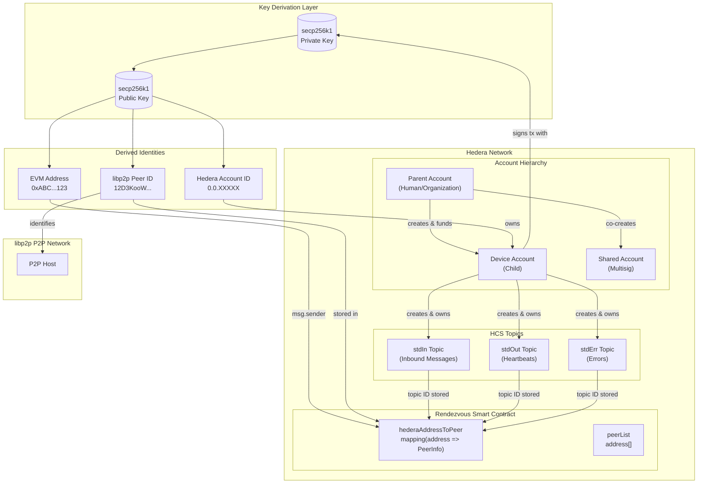
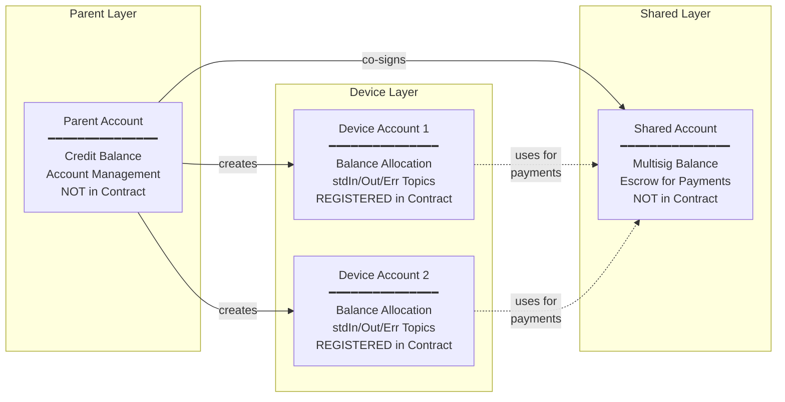
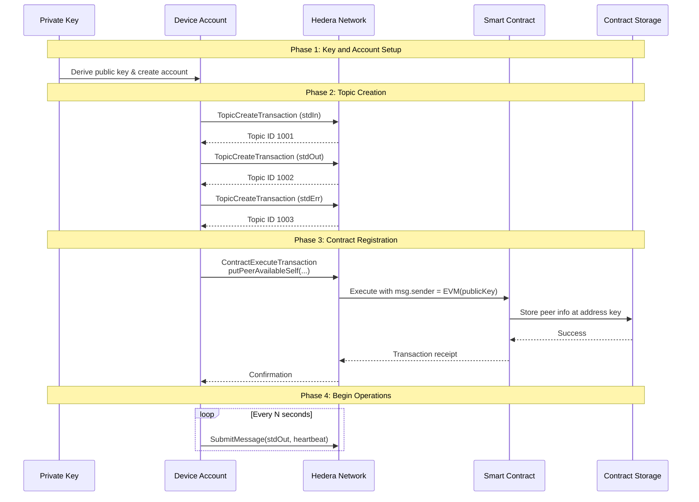
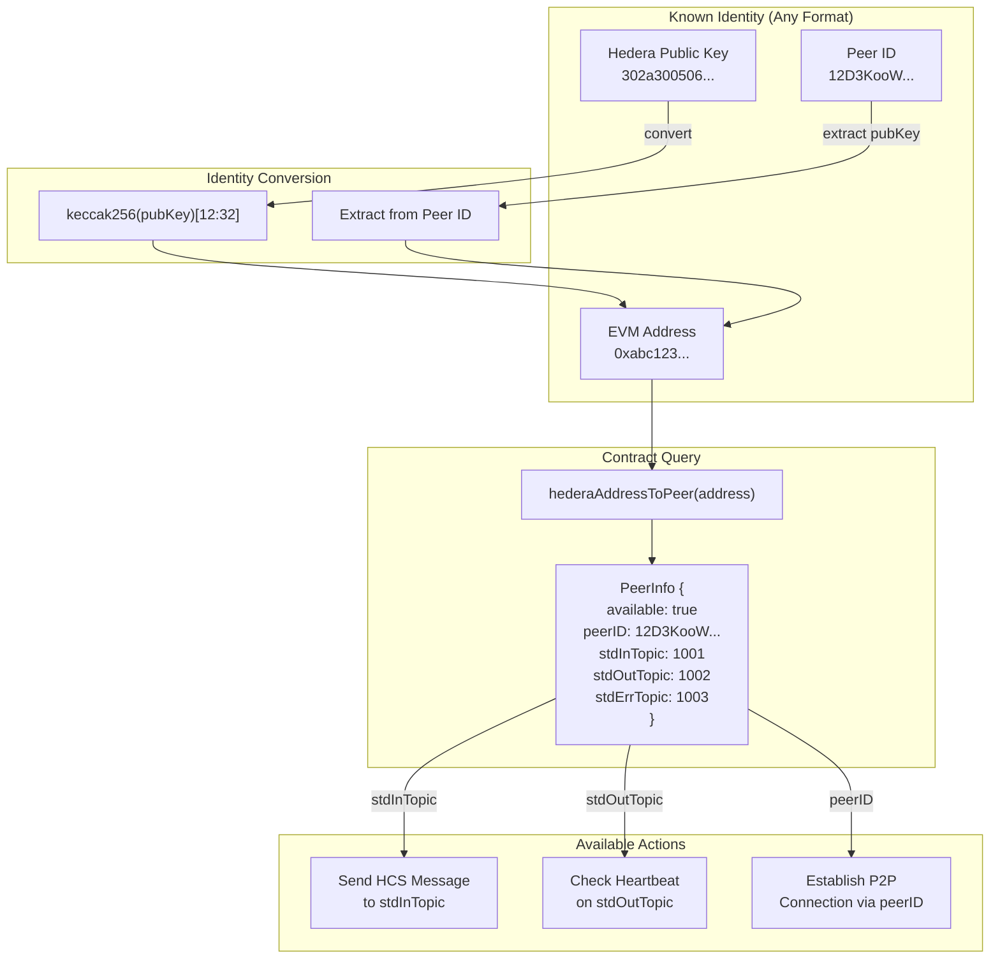
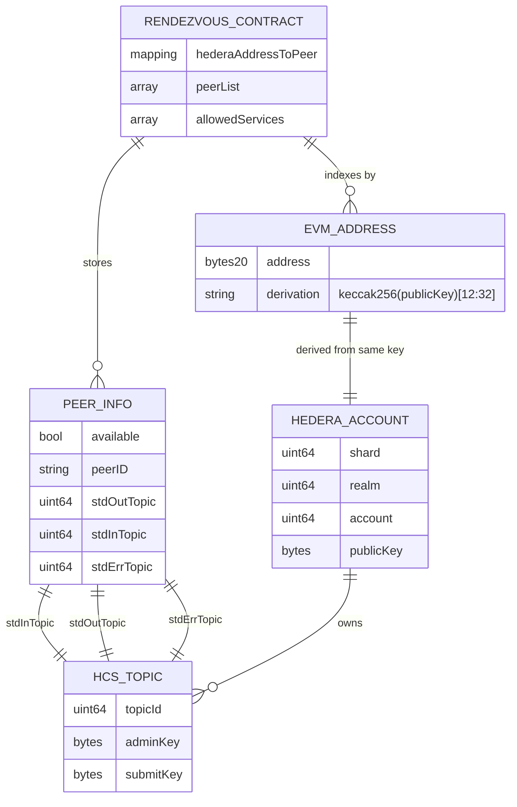
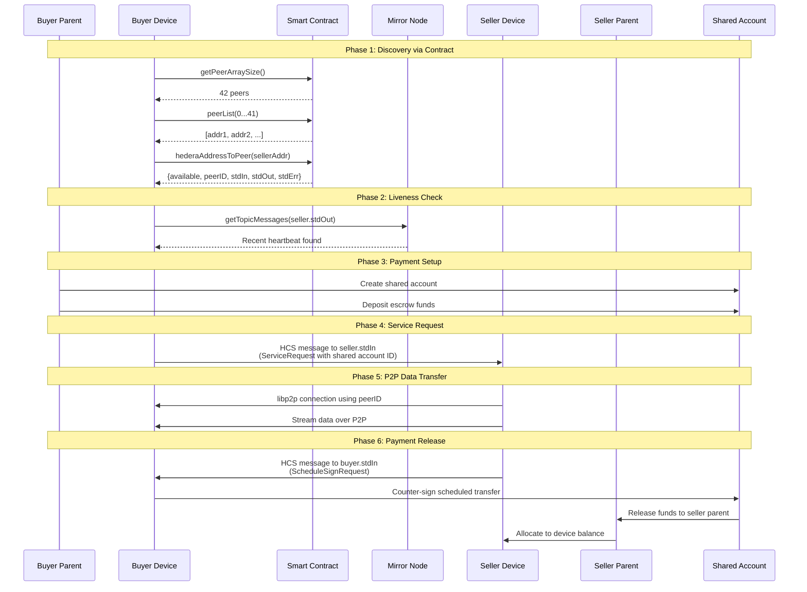
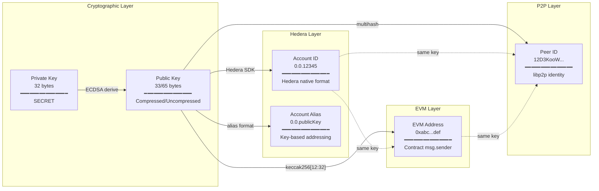

# Rendezvous Contract Specification

## Overview

The Rendezvous contract is a Hedera smart contract that serves as the central registry and discovery mechanism for the Neuron network. It enables decentralized peer discovery by maintaining a mapping between Hedera account addresses and their corresponding communication endpoints.

This document describes the contract's role, its data structures, the registration process, and how peers interact with it for discovery and communication.

---

## Table of Contents

1. [Contract Purpose](#contract-purpose)
2. [Account and Contract Relationship](#account-and-contract-relationship)
3. [Data Structures](#data-structures)
4. [Contract Functions](#contract-functions)
5. [Registration Process](#registration-process)
6. [Peer Discovery](#peer-discovery)
7. [Integration with HCS Topics](#integration-with-hcs-topics)
8. [Lifecycle of a Registered Peer](#lifecycle-of-a-registered-peer)
9. [Security Considerations](#security-considerations)
10. [Appendix A: Account and Contract Relationship Diagrams](#appendix-a-account-and-contract-relationship-diagrams)
11. [Appendix B: Contract ABI](#appendix-b-contract-abi)

---

## Contract Purpose

The Rendezvous contract fulfills three primary functions in the Neuron network:

### 1. Peer Registry

The contract maintains a persistent, on-chain record of all participating peers. Each peer registers itself with the contract, providing the necessary information for other peers to discover and communicate with it.

### 2. Communication Endpoint Discovery

When a peer wants to communicate with another peer, it queries the contract to retrieve the target peer's HCS (Hedera Consensus Service) topic IDs. These topics serve as the communication channels for the rendezvous protocol.

### 3. Availability Tracking

The contract tracks whether a peer has registered itself as available. Combined with heartbeat monitoring on the peer's stdout topic, this allows the network to determine which peers are actively participating.

---

## Account and Contract Relationship

The Rendezvous contract operates within the context of the Neuron account hierarchy. Understanding this relationship is essential for comprehending how accounts interact with the contract and how identity is established across the system.

### Account Hierarchy

The Neuron network uses a hierarchical account structure:

```
Parent Account (Human/Organization)
    |
    +-- Credit Balance (primary funds)
    |
    +-- Device Account 1 (Child)
    |       |
    |       +-- Balance Allocation (operational funds)
    |       +-- stdIn Topic
    |       +-- stdOut Topic
    |       +-- stdErr Topic
    |       +-- Contract Registration
    |
    +-- Device Account 2 (Child)
    |       |
    |       +-- (same structure)
    |
    +-- Shared Account (for multi-party transactions)
            |
            +-- Multisig Balance
            +-- Threshold Signing Configuration
```

### Account Types and Contract Interaction

| Account Type           | Contract Registration | Purpose                                      |
| ---------------------- | --------------------- | -------------------------------------------- |
| Parent Account         | Not registered        | Holds primary funds, manages child accounts  |
| Device Account (Child) | Registered            | Active network participant, runs SDK         |
| Shared Account         | Not registered        | Payment escrow for buyer-seller transactions |

Only Device Accounts register with the Rendezvous contract. Parent Accounts and Shared Accounts serve supporting roles but do not appear in the contract's peer registry.

### Identity Derivation Chain

A single secp256k1 key pair establishes identity across multiple systems. The contract uses the EVM address derived from this key as the primary identifier:

```
secp256k1 Private Key
    |
    v
secp256k1 Public Key
    |
    +---> Hedera Account ID
    |         - Format: 0.0.XXXXX
    |         - Used for: Hedera transactions, topic operations
    |
    +---> EVM Address (Contract Key)
    |         - Derivation: keccak256(publicKey)[12:32]
    |         - Format: 0x followed by 40 hex characters
    |         - Used for: Contract storage key (msg.sender)
    |
    +---> libp2p Peer ID
              - Derivation: multihash of public key
              - Format: 12D3KooW...
              - Used for: P2P network identity, stored in contract
```

### How Contract Registration Links to Account

When a Device Account registers with the contract, the following associations are established:

1. **Transaction Sender**: The Hedera account signs the contract call transaction. Hedera translates this to an EVM address for the smart contract.

2. **Storage Key**: The contract uses `msg.sender` (the EVM address) as the key in its `hederaAddressToPeer` mapping.

3. **Peer ID Storage**: The libp2p Peer ID (derived from the same key) is stored as a string field, enabling P2P connection after discovery.

4. **Topic Ownership**: The HCS topics are created by and belong to the same Hedera account, ensuring only the account holder can administer them.

```
Device Account Registration Flow:

    Device Account (0.0.12345)
           |
           | Signs ContractExecuteTransaction
           v
    Hedera Network
           |
           | Translates to EVM context
           v
    Smart Contract Execution
           |
           | msg.sender = 0xABC...123 (derived from account's public key)
           v
    Contract Storage
           |
           hederaAddressToPeer[0xABC...123] = {
               available: true,
               peerID: "12D3KooW...",
               stdInTopic: 1001,
               stdOutTopic: 1002,
               stdErrTopic: 1003
           }
```

### Account-to-Contract Address Resolution

To query the contract for a peer's information, other participants must convert between identifier formats:

```go
// Starting with a Hedera public key (from heartbeat or prior knowledge)
hederaPublicKey := "302a300506032b6570032100..."

// Convert to EVM address for contract lookup
evmAddress := keylib.ConverHederaPublicKeyToEthereunAddress(hederaPublicKey)
// Result: "abc123def456..." (40 hex chars, no 0x prefix in this implementation)

// Query contract
peerInfo, err := contract.HederaAddressToPeer(evmAddress)
```

The reverse resolution (from contract entry to connectable peer) uses the stored `peerID`:

```go
// Retrieved from contract
peerIDString := peerInfo.PeerID  // "12D3KooWxxxxxxx..."

// Decode to libp2p peer.ID for P2P operations
peerID, err := peer.Decode(peerIDString)

// Now can establish P2P connection
p2pHost.Connect(ctx, peer.AddrInfo{ID: peerID, Addrs: ...})
```

### Financial Account Relationships

The account hierarchy also establishes financial relationships that work alongside the contract:

```
Payment Flow:

1. Buyer's Parent Account
       |
       | Funds allocation
       v
2. Shared Account (created for transaction)
       |
       | Holds escrowed payment
       |
       | Scheduled transfer (requires both signatures)
       v
3. Seller's Parent Account
       |
       | Internal transfer
       v
4. Seller's Device Account (operational balance)
```

The Rendezvous contract facilitates peer discovery, but the actual payment flow uses:

- Hedera's native transfer transactions
- Scheduled transactions for escrow release
- Parent-child account relationships for fund management

### Account Verification via Contract

Before engaging in transactions, peers verify each other through the contract:

```
Verification Steps:

1. Obtain peer's public key (from HCS message signature or prior exchange)

2. Derive EVM address from public key

3. Query contract: hederaAddressToPeer(evmAddress)

4. Verify:
   - available == true (peer is registered)
   - peerID matches expected value (identity consistency)
   - stdOutTopic has recent heartbeats (peer is active)

5. If all checks pass, proceed with communication/transaction
```

### Summary of Account-Contract Binding

| Aspect             | Hedera Account                        | Contract Entry         |
| ------------------ | ------------------------------------- | ---------------------- |
| Primary Identifier | Account ID (0.0.XXXXX)                | EVM Address (0x...)    |
| Derived From       | Public key alias or explicit creation | keccak256(publicKey)   |
| Authentication     | Transaction signatures                | msg.sender in contract |
| P2P Identity       | N/A                                   | Stored peerID field    |
| Communication      | Owns HCS topics                       | Stores topic IDs       |
| Discoverability    | Via mirror node                       | Via contract queries   |

---

## Data Structures

### Peer Information Structure

The contract stores the following information for each registered peer:

| Field         | Type   | Description                                                  |
| ------------- | ------ | ------------------------------------------------------------ |
| `available`   | bool   | Indicates whether the peer is registered and available       |
| `peerID`      | string | The libp2p peer ID derived from the peer's public key        |
| `stdOutTopic` | uint64 | HCS topic ID where the peer publishes heartbeats and outputs |
| `stdInTopic`  | uint64 | HCS topic ID where the peer receives incoming messages       |
| `stdErrTopic` | uint64 | HCS topic ID where the peer publishes error messages         |

### Storage Mappings

The contract maintains two primary storage structures:

1. **Address-to-Peer Mapping**: Maps an Ethereum-compatible address to the peer's information structure. The address is derived from the peer's secp256k1 public key.

2. **Peer List Array**: An array of all registered peer addresses, enabling enumeration of all participants in the network.

---

## Contract Functions

### Write Functions

#### putPeerAvailableSelf

```solidity
function putPeerAvailableSelf(
    uint64 stdOutTopic,
    uint64 stdInTopic,
    uint64 stdErrTopic,
    string peerID,
    uint8[] serviceIDs,
    uint8[] prices
) external
```

**Purpose**: Registers or updates the calling peer's information in the contract.

**Parameters**:

- `stdOutTopic`: The numeric ID of the HCS topic for outbound messages (heartbeats)
- `stdInTopic`: The numeric ID of the HCS topic for inbound messages (requests)
- `stdErrTopic`: The numeric ID of the HCS topic for error logging
- `peerID`: The libp2p peer ID string (e.g., "12D3KooWxxxxxxx...")
- `serviceIDs`: Array of service type identifiers the peer offers
- `prices`: Array of prices corresponding to each service

**Behavior**:

- The sender's address (`msg.sender`) is used as the key for storage
- If the peer is not already in the peer list, it is added
- The peer's availability is set to true
- All provided information is stored in the mapping

### Read Functions

#### hederaAddressToPeer

```solidity
function hederaAddressToPeer(address) external view returns (
    bool available,
    string peerID,
    uint64 stdOutTopic,
    uint64 stdInTopic,
    uint64 stdErrTopic
)
```

**Purpose**: Retrieves the peer information for a given address.

**Parameters**:

- `address`: The Ethereum-compatible address of the peer to query

**Returns**: The complete peer information structure.

#### getPeerArraySize

```solidity
function getPeerArraySize() external view returns (uint256)
```

**Purpose**: Returns the total number of registered peers.

**Returns**: The length of the peer list array.

#### peerList

```solidity
function peerList(uint256 index) external view returns (address)
```

**Purpose**: Retrieves the address at a specific index in the peer list.

**Parameters**:

- `index`: The zero-based index in the peer list

**Returns**: The Ethereum-compatible address of the peer at that index.

#### allowedServices

```solidity
function allowedServices(uint256 index) external view returns (string)
```

**Purpose**: Retrieves the service name at a specific index in the allowed services list.

**Parameters**:

- `index`: The zero-based index in the services list

**Returns**: The service name string.

---

## Registration Process

The registration of a new peer involves the following sequence of operations:

### Step 1: Key Derivation

The peer starts with a secp256k1 private key and derives the following identities:

```
Private Key (secp256k1, 32 bytes)
    |
    +-- Public Key (compressed or uncompressed)
          |
          +-- libp2p Peer ID (multihash of public key)
          |
          +-- Ethereum Address (last 20 bytes of keccak256(public key))
          |
          +-- Hedera Account (alias or explicit account ID)
```

### Step 2: HCS Topic Creation

Before registering with the contract, the peer must create three HCS topics:

1. **stdin Topic**: For receiving messages from other peers
2. **stdout Topic**: For broadcasting heartbeats and responses
3. **stderr Topic**: For publishing error messages and diagnostics

Each topic is created using the Hedera SDK's `TopicCreateTransaction`. The peer's account pays for the topic creation and becomes the topic's admin.

### Step 3: Contract Invocation

The peer calls `putPeerAvailableSelf` with the following information:

```
putPeerAvailableSelf(
    stdOutTopic: 1002,          // Topic ID from step 2
    stdInTopic: 1001,           // Topic ID from step 2
    stdErrTopic: 1003,          // Topic ID from step 2
    peerID: "12D3KooW...",      // Derived in step 1
    serviceIDs: [1, 2],         // Services offered
    prices: [100, 200]          // Prices in tinybars
)
```

The transaction is signed with the peer's private key, which proves ownership of the corresponding address.

### Step 4: Heartbeat Initialization

After successful registration, the peer begins publishing periodic heartbeat messages to its stdout topic. These heartbeats contain:

- Current timestamp
- Geographic location (if configured)
- Software version
- Current status

---

## Peer Discovery

Other peers discover registered participants through the following mechanisms:

### Method 1: Direct Lookup

When a peer knows the target's public key or address, it can directly query the contract:

```go
// Convert Hedera public key to EVM address
evmAddress := keylib.ConverHederaPublicKeyToEthereunAddress(publicKey)

// Query the contract
peerInfo, err := contract.HederaAddressToPeer(evmAddress)

// Verify availability
if peerInfo.Available {
    // Use peerInfo.StdInTopic to send messages
}
```

### Method 2: Full Enumeration

To discover all available peers, a client can enumerate the peer list:

```go
// Get total count
size, err := contract.GetPeerArraySize()

// Iterate through all peers
for i := 0; i < size; i++ {
    address, _ := contract.PeerList(i)
    peerInfo, _ := contract.HederaAddressToPeer(address)

    if peerInfo.Available {
        // Process available peer
    }
}
```

### Method 3: External Explorer Service

The Neuron network also provides an external explorer API that caches and indexes contract data for faster queries:

```
GET https://explorer.neuron.world/api/v1/device/wip-all
```

This returns a JSON array of all registered devices with their metadata.

---

## Integration with HCS Topics

The Rendezvous contract works in conjunction with HCS topics to enable communication:

### Topic Roles

| Topic  | Direction | Purpose                                                               |
| ------ | --------- | --------------------------------------------------------------------- |
| stdin  | Inbound   | Receives service requests, hole-punch requests, payment confirmations |
| stdout | Outbound  | Publishes heartbeats, service responses, availability status          |
| stderr | Outbound  | Publishes error messages, diagnostic information                      |

### Message Flow Example

The following illustrates a typical buyer-seller interaction:

```
1. Buyer queries contract for Seller's topic IDs

   Contract.hederaAddressToPeer(sellerAddress)
   -> Returns: stdInTopic=1001, stdOutTopic=1002

2. Buyer verifies Seller is alive by checking stdout topic

   MirrorNode.getTopicMessages(1002)
   -> Check for recent heartbeat (within last 5-10 minutes)

3. Buyer sends service request to Seller's stdin topic

   HCS.submitMessage(topicId=1001, message=ServiceRequest{...})

4. Seller receives request, processes it, responds via P2P stream

   (Direct libp2p connection using peerID from contract)

5. Seller sends invoice to Buyer's stdin topic

   HCS.submitMessage(topicId=buyerStdIn, message=ScheduleSignRequest{...})
```

### Heartbeat Structure

Peers publish heartbeats to their stdout topic with the following structure:

```json
{
  "messageType": "heartbeat",
  "timestamp": "2024-01-15T10:30:00Z",
  "location": {
    "latitude": 51.5074,
    "longitude": -0.1278,
    "altitude": 0
  },
  "version": "0.4",
  "status": "available"
}
```

---

## Lifecycle of a Registered Peer

### Phase 1: Initialization

1. Generate or load secp256k1 private key
2. Derive public key, peer ID, and EVM address
3. Ensure Hedera account has sufficient balance
4. Create HCS topics (stdin, stdout, stderr)
5. Call `putPeerAvailableSelf` to register with contract

### Phase 2: Active Operation

1. Publish heartbeats every N seconds to stdout topic
2. Listen for incoming messages on stdin topic
3. Process requests and establish P2P connections
4. Handle payments via scheduled transactions

### Phase 3: Graceful Shutdown

1. Stop publishing heartbeats
2. Complete any in-progress transactions
3. Optionally update contract to mark as unavailable

### Phase 4: Detection of Inactive Peers

Other peers detect inactive participants by:

1. Querying the contract to get stdout topic ID
2. Checking the mirror node for recent messages on that topic
3. If no heartbeat within threshold (e.g., 5-10 minutes), consider peer offline

---

## Security Considerations

### Identity Verification

The contract relies on the following security properties:

1. **Ownership Proof**: Only the holder of the private key can register or update the corresponding address entry, as the transaction must be signed by that key.

2. **Topic Ownership**: The peer creates its own HCS topics and controls who can submit messages (via topic keys).

3. **Public Key Derivation**: The libp2p peer ID is cryptographically derived from the same key pair, ensuring consistency between contract registration and P2P identity.

### Potential Attack Vectors

| Attack             | Mitigation                                           |
| ------------------ | ---------------------------------------------------- |
| Impersonation      | Transaction signatures prove ownership of address    |
| Topic Hijacking    | Topic admin keys controlled by peer                  |
| Stale Registration | Heartbeat monitoring detects inactive peers          |
| Spam Registration  | Transaction fees (gas) make mass registration costly |

### Trust Assumptions

1. The Hedera network correctly executes smart contract logic
2. The mirror node provides accurate topic message history
3. Peers honestly report their service offerings and prices

---

## Appendix A: Account and Contract Relationship Diagrams

### A.1 Complete System Overview



### A.2 Account Hierarchy and Roles



### A.3 Registration Flow Sequence



### A.4 Identity Resolution and Discovery



### A.5 Contract Storage Structure



### A.6 Complete Buyer-Seller Interaction with Contract



### A.7 Key-to-Identity Mapping



---

## Appendix B: Contract ABI

```json
[
  {
    "inputs": [
      { "internalType": "uint64", "name": "stdOutTopic", "type": "uint64" },
      { "internalType": "uint64", "name": "stdInTopic", "type": "uint64" },
      { "internalType": "uint64", "name": "stdErrTopic", "type": "uint64" },
      { "internalType": "string", "name": "peerID", "type": "string" },
      { "internalType": "uint8[]", "name": "serviceIDs", "type": "uint8[]" },
      { "internalType": "uint8[]", "name": "prices", "type": "uint8[]" }
    ],
    "name": "putPeerAvailableSelf",
    "outputs": [],
    "stateMutability": "nonpayable",
    "type": "function"
  },
  {
    "inputs": [{ "internalType": "address", "name": "", "type": "address" }],
    "name": "hederaAddressToPeer",
    "outputs": [
      { "internalType": "bool", "name": "available", "type": "bool" },
      { "internalType": "string", "name": "peerID", "type": "string" },
      { "internalType": "uint64", "name": "stdOutTopic", "type": "uint64" },
      { "internalType": "uint64", "name": "stdInTopic", "type": "uint64" },
      { "internalType": "uint64", "name": "stdErrTopic", "type": "uint64" }
    ],
    "stateMutability": "view",
    "type": "function"
  },
  {
    "inputs": [],
    "name": "getPeerArraySize",
    "outputs": [{ "internalType": "uint256", "name": "", "type": "uint256" }],
    "stateMutability": "view",
    "type": "function"
  },
  {
    "inputs": [{ "internalType": "uint256", "name": "", "type": "uint256" }],
    "name": "peerList",
    "outputs": [{ "internalType": "address", "name": "", "type": "address" }],
    "stateMutability": "view",
    "type": "function"
  },
  {
    "inputs": [{ "internalType": "uint256", "name": "", "type": "uint256" }],
    "name": "allowedServices",
    "outputs": [{ "internalType": "string", "name": "", "type": "string" }],
    "stateMutability": "view",
    "type": "function"
  }
]
```
